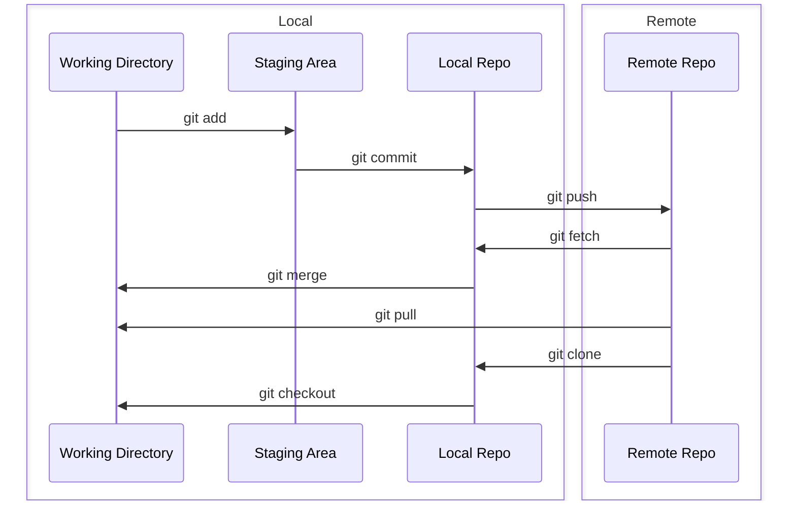

<p align="center">
<a href="https://www.npmjs.com/package/convert-markdown-to-html" target="_blank" rel="noopener noreferrer">
</a>
</p>

<p align="center">
  A script converts markdown to html
</p>

<p align="center">
  <a href="https://www.npmjs.com/package/convert-markdown-to-html" target="_blank" rel="noopener noreferrer"></a>
  <a href="https://www.npmjs.com/package/convert-markdown-to-html" target="_blank" rel="noopener noreferrer"></a>
  <a href="https://bundlephobia.com/result?p=convert-markdown-to-html" target="_blank" rel="noopener noreferrer"></a>
  <a href="https://github.com/hunghg255/convert-markdown-to-html/graphs/contributors" target="_blank" rel="noopener noreferrer"></a>
  <a href="https://github.com/hunghg255/convert-markdown-to-html/blob/main/LICENSE" target="_blank" rel="noopener noreferrer"></a>
</p>

## Features

- Support Syntax Highlighting
- Support Github Alert
- Support Emoji
- Support Table of Contents
- Support Mermaid
- Support Katex
- Support Twoslash powered by [Shiki](https://shiki.style/)

## Link Demo

[Demo](https://hunghg255.github.io/convert-markdown-to-html)

## API

```md
--i: input file
--o: output file
--t: title
--g: github link
```

## CLI

- Option 1

```bash
npx convert-markdown-to-html@latest --i README.md --o docs/index.html --t "Convert Markdown to HTML" --g "https://github.com/hunghg255/convert-markdown-to-html"
```

- Option 2

```bash
npm i convert-markdown-to-html@latest --save-dev
```

- Config (file package.json)

```json title=package.json
{
  ...
  "scripts": {
    ...
    "gen-docs": "convert-markdown-to-html --i README.md --o docs/index.html --t \"Convert Markdown to HTML\" --g \"https://github.com/hunghg255/convert-markdown-to-html\""
  },
  ...
}
```

## Install

```ts
import { markdownToDocs } from 'convert-markdown-to-html';

declare const markdownToDocs: (
  isTwoSlash: boolean;
  title: string;
  description?: string;
  logo?: string;
  socialLinks?: {
      icon?: 'twitter' | 'github';
      url?: string;
  }[];
  footer?: {
      message?: string;
      copyright?: string;
  };
  head?: Array<[string, Record<string, string>]>;
) => Promise<string>;

const markdownContent = `# Hello World`;
const html = markdownToDocs(markdownContent, {
  isTwoSlash: true,

  title: 'My Docs',
  description: 'My awesome documentation',

  logo: '',

  socialLinks: [
    {
      icon: 'twitter',
      url: 'https://github.com',
    },
    {
      icon: 'github',
      url: 'https://github.com',
    },
  ],
  footer: {
    message: 'Released under the MIT License',
    copyright: 'Copyright © 2023-present Hunghg255',
  },

  head: [
    [
      'link',
      { rel: 'icon', type: 'image/png', href: 'https://hung.thedev.id/images/patak-banner.jpg' },
    ],
    ['meta', { property: 'og:type', content: 'website' }],
    ['meta', { property: 'og:title', content: ogTitle }],
    ['meta', { property: 'og:image', content: ogImage }],
    ['meta', { property: 'og:url', content: ogUrl }],
    ['meta', { property: 'og:description', content: ogDescription }],
    ['meta', { name: 'twitter:card', content: 'summary_large_image' }],
    ['meta', { name: 'twitter:site', content: '@hunghg255' }],
    ['meta', { name: 'theme-color', content: '#7eaf90' }],
  ],
});
```

## Demo

[Code Markdown](https://github.com/hunghg255/convert-markdown-to-html/blob/main/docs/content.md)

- Code Highlight

```js
console.log(1); // [!code ++]
console.log(1); // [!code --]
console.log(1); // [!code highlight]
console.log(1); // [!code error]
console.log(1); // [!code warning]
```

```js
console.log(1);
console.log(1); // [!code focus]
console.log(1);
```

- Code Group

:::code-group-open

```bash [npm]
 npm install @nuxtjs/html-validator --save-dev
```

```bash [yarn]
 yarn add @nuxtjs/html-validator --dev
```

```bash [pnpm]
 pnpm i -D @nuxtjs/html-validator
```

```bash [bun]
 bun install @nuxtjs/html-validator --save-dev
```

:::code-group-close

:::code-group-open

```js
const a = 2;
```

```ts
const a: number = 2;
```

:::code-group-close

- Github Alert

> [!NOTE]
> Highlights information that users should take into account, even when skimming.

> [!TIP]
> Optional information to help a user be more successful.

> [!IMPORTANT]
> Crucial information necessary for users to succeed.

> [!WARNING]
> Critical content demanding immediate user attention due to potential risks.

> [!CAUTION]
> Negative potential consequences of an action.

- Katex

| equation                                                                                                                                                                  | description                                                                            |
| ------------------------------------------------------------------------------------------------------------------------------------------------------------------------- | -------------------------------------------------------------------------------------- |
| $\nabla \cdot \vec{\mathbf{B}}  = 0$                                                                                                                                      | divergence of $\vec{\mathbf{B}}$ is zero                                               |
| $\nabla \times \vec{\mathbf{E}}\, +\, \frac1c\, \frac{\partial\vec{\mathbf{B}}}{\partial t}  = \vec{\mathbf{0}}$                                                          | curl of $\vec{\mathbf{E}}$ is proportional to the rate of change of $\vec{\mathbf{B}}$ |
| $\nabla \times \vec{\mathbf{B}} -\, \frac1c\, \frac{\partial\vec{\mathbf{E}}}{\partial t} = \frac{4\pi}{c}\vec{\mathbf{j}}    \nabla \cdot \vec{\mathbf{E}} = 4 \pi \rho$ | _wha?_                                                                                 |

$$
x^3 + y^3 = z^3
$$

$$
\frac{\bcancel{\frac13}}{\bcancel{\frac13}} = 1
$$

$$
\begin{aligned}

(a+b)^2 &= (a+b)(a+b)           \\
        &= a^2 + ab + ba + b^2  \\
        &= a^2 + 2ab + b^2
\end{aligned}
$$

$$
\cfrac{2}{1+\cfrac{2}{1+\cfrac{2}{1}}}
$$

$$
P\implies Q
$$

$$
a + \lt b\gt + c
$$

$$
\sum\nolimits_{k=1}^n a_k
$$

$$
\frac ab + {\scriptscriptstyle \frac cd + \frac ef} + \frac gh
$$

$$
\sum_{ \substack{ 1\lt i\lt 3 \\ 1\le j\lt 5 }} a_{ij}
$$

$$
\underbrace{x + \cdots + x}_{n\rm\ times}
$$

$$
\left(\vcenter{\frac{a+b}{\dfrac{c}{d}}}\right)
$$

$$
x+\xcancel{5y}=0
$$

$$
\def\arraystretch{1.5}
  \begin{array}{c:c:c}
  a & b & c \\ \hline
  d & e & f \\
  \hdashline
  g & h & i
\end{array}
$$

- Mermaid



- Twoslash

```ts twoslash title=blog.ts
import MarkdownIt from 'markdown-it';

console.log(1);
console.log(2);
//      ^?
```

```ts twoslash title=blog.ts
import { getHighlighterCore } from '@shikijs/core';

const highlighter = await getHighlighterCore({});

import { transformerTwoslash as transformerTwoslashVue } from '@shikijs/vitepress-twoslash';

import { rendererRich, transformerTwoslash } from '@shikijs/twoslash';

transformerTwoslash({
  renderer: rendererRich(), // <--
  explicitTrigger: true, // <--
});

import {
  transformerNotationDiff,
  // ...
} from '@shikijs/transformers';

const code = `console.log('hello')`;
```

```ts twoslash
Number.parseInt('123', 10);
//      ^|
```

```ts twoslash
const obj = {
  boo: 1,
  bar: () => 2,
  baz: 'string',
};
obj.boo;
//   ^|
```

```ts twoslash
// @errors: 2322 2588
const str: string = 1;
str = 'Hello';
```

```ts twoslash
// @log: Custom log message
const a = 1;
// @error: Custom error message
const b = 1;
// @warn: Custom warning message
const c = 1;
// @annotate: Custom annotation message
const d = 1;
```

- Block space

```ts
function block() {
  space();
  if (true) {
    table();
  }
}
```

- Word highlight

```ts
export function foo() {
  // [!code word:Hello]
  const msg = 'Hello World';
  console.log(msg); // prints Hello World
}
```

```ts
// [!code word:options:2]
const options = { foo: 'bar' };
options.foo = 'baz';
console.log(options.foo); // this one will not be highlighted
```
